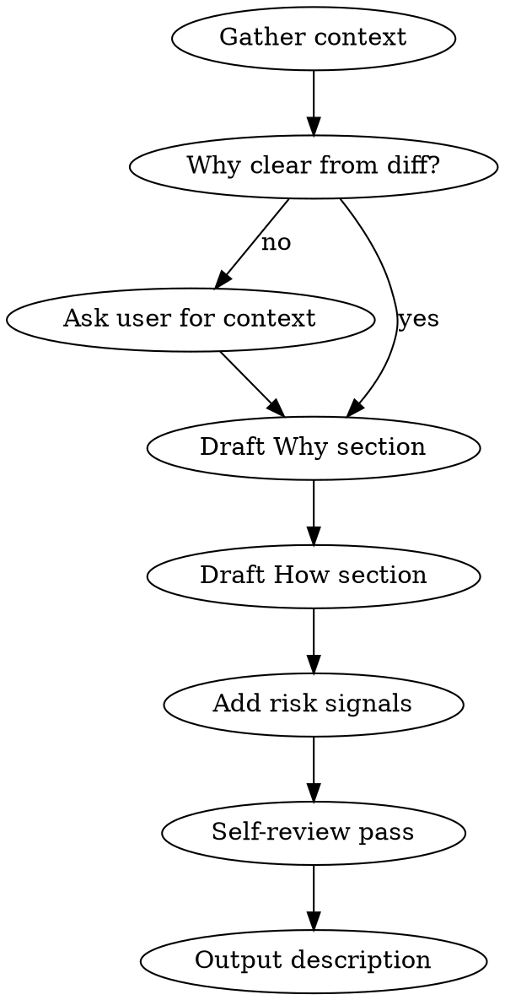

# Writing PR Descriptions

Generate concise, reviewer-friendly PR descriptions that communicate **why** before **what**.

## When to Use

- Before creating a PR (`gh pr create`, `gt submit`)
- When asked to write/update a PR description
- As part of self-review before requesting human review

## Process



### 1. Gather Context

**Scope: current branch only.** In stacked PR workflows (Graphite), only describe changes in the current branch's commits — not parent or child branches.

Use Graphite and git to understand the stack and isolate this branch's changes:

- `gt log short` — see the full stack structure and where this branch sits
- `gt info` — show current branch metadata and parent
- `git diff @{upstream}...HEAD` — diff for THIS branch only
- `git log --oneline @{upstream}..HEAD` — commits on THIS branch only
- Read the repo's PR template at `.github/pull_request_template.md`
- Check for linked tickets (Linear, Asana) in commits or branch name

### 2. Draft "Why" Section

**This is the most important section.** Answer: What problem exists today, and what does this change accomplish?

**If the "why" is not clear from the diff, commits, or ticket — ASK the user.** The diff often shows _what_ changed but not _why_. Common cases where you must ask:

- The branch is part of a larger project/initiative
- Business logic changes with non-obvious motivation
- Refactors where the trigger isn't apparent (compliance? performance? tech debt?)
- Changes that only make sense in context of other stacked PRs

Ask concisely: _"What's the motivation for this change? Is it part of a larger project?"_

Rules:

- Lead with the **business or user problem**, not the technical implementation
- Link to the ticket (required for production changes)
- One sentence for the goal, one for the motivation
- If the PR bundles multiple concerns, explain why they're together

**Good:**

> Users need to configure notification preferences per workspace, but the current API applies a single setting globally. This blocks teams with different compliance requirements per region.
>
> Closes [TICKET-URL]

**Bad:**

> Replaces flat `workspaceIds` argument with structured `WorkspaceSettingsInput` list in `updateNotificationPreferences` mutation.

### 3. Draft "How" Section

Concise summary of the approach — NOT a file-by-file changelog.

Rules:

- 3-7 bullet points max covering the approach
- Group by concept, not by file/layer
- Mention architectural decisions ("chose X over Y because...")
- Skip trivial changes (import reordering, rename-only)
- **Be terse.** Each bullet should be one line. Cut filler words. If a bullet needs a second sentence, it's two bullets or you're over-explaining.

**Good:**

> - Per-workspace `WorkspaceSettingsInput` replaces flat args — each workspace carries its own notification config
> - Multi-step wizard (Select Workspaces → Configure Rules → Review) replaces single-page form
> - Split Zod schema into admin/member variants for role-based validation
> - Rollback on mutation errors to prevent partial writes

**Bad:**

> - Updated `mutation.py` line 45-120
> - Added `WorkspaceNotificationSetup` component
> - Added `ConfigureRules` component
> - Modified `NotificationSchema.ts`
> - Updated 12 test files

### 4. Add Risk & Confidence Signals

After the "How" section, add a brief "Review guidance" block:

```markdown
**Review guidance:**

- **Risk:** [high/medium/low] — [why]
- **Change type:** [behavior change / refactor only / new feature / bugfix]
- **Areas needing scrutiny:** [specific files, logic, or edge cases]
- **Confidence:** [high/medium/low] — [context, e.g., "first time in this area" or "well-tested pattern"]
```

Only include lines that add signal. Skip if obvious.

### 5. Self-Review Pass

Before outputting, verify:

- [ ] "Why" answers the question a reviewer unfamiliar with the ticket would ask
- [ ] "How" is scannable in under 30 seconds
- [ ] Risk signals flag anything non-obvious
- [ ] Description works for both human and AI reviewers (the "why" gives AI reviewers the context they need)
- [ ] No changelog dumps masquerading as descriptions
- [ ] **Conciseness check:** Re-read the entire description and cut any word that doesn't add information. No filler, no hedging, no restating what the diff already shows. Prefer sentence fragments over full sentences when meaning is clear.

## Template Output

**Always check for a project-specific PR template first** at `.github/pull_request_template.md` (already read in step 1). If one exists, use that template's structure and fill in its sections following the principles in this skill (why before what, concise bullets, risk signals). Only fall back to the default template below when no project template is found.

### Default Template (fallback)

```markdown
## Why are you making this change?

[Business/user problem. Goal of the change. Ticket link.]

## How does this change work?

[3-7 conceptual bullets. Architectural decisions if any.]

**Review guidance:**

- **Risk:** [level] — [reason]
- **Change type:** [type]
- **Areas needing scrutiny:** [specifics]

## QA & Review Guidelines

- [ ] I have provided proof of QA (thorough tests, reviewed copy, automat link, screenshot or Loom) above.
```

## Common Mistakes

| Mistake                               | Fix                                                                                 |
| ------------------------------------- | ----------------------------------------------------------------------------------- |
| "Why" describes the code change       | Rewrite to describe the problem/goal                                                |
| "How" is a file-by-file changelog     | Regroup by concept, cut to 3-7 bullets                                              |
| No risk signals on behavior changes   | Always flag behavior changes explicitly                                             |
| Auto-generated description used as-is | Always read and trim Graphite/AI output                                             |
| Missing ticket link                   | Add it — required for production changes                                            |
| Wordy descriptions                    | Cut filler. Every word should earn its place. Prefer fragments over full sentences. |
