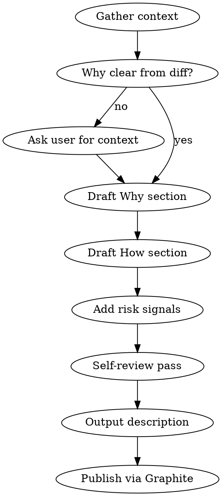

# Writing PR Descriptions

Generate concise, reviewer-friendly PR descriptions that communicate **why** before **what**.

## When to Use

- Before creating a PR (prefer `gt submit`; `gh pr create` is the fallback)
- When asked to write/update a PR description
- As part of self-review before requesting human review

## Process


```dot
digraph pr_description {
  rankdir=TB;
  "Gather context" -> "Why clear from diff?";
  "Why clear from diff?" -> "Ask user for context" [label="no"];
  "Ask user for context" -> "Draft Why section";
  "Why clear from diff?" -> "Draft Why section" [label="yes"];
  "Draft Why section" -> "Draft How section";
  "Draft How section" -> "Add risk signals";
  "Add risk signals" -> "Self-review pass";
  "Self-review pass" -> "Output description";
  "Output description" -> "Publish via Graphite";
}
```

### 1. Gather Context

**Scope: current branch only.** In stacked PR workflows (Graphite), only describe changes in the current branch's commits — not parent or child branches.

Use Graphite and git to understand the stack and isolate this branch's changes:

- `gt log short` — see the full stack structure and where this branch sits
- `gt info` — show current branch metadata and parent
- `git diff @{upstream}...HEAD` — diff for THIS branch only
- `git log --oneline @{upstream}..HEAD` — commits on THIS branch only
- Read the repo's PR template at `.github/pull_request_template.md`
- Check for linked tickets (Linear, Asana) in commits or branch name

### 2. Draft "Why" Section

**This is the most important section.** Answer: What problem exists today, and what does this change accomplish?

**If the "why" is not clear from the diff, commits, or ticket — ASK the user.** The diff often shows _what_ changed but not _why_. Common cases where you must ask:

- The branch is part of a larger project/initiative
- Business logic changes with non-obvious motivation
- Refactors where the trigger isn't apparent (compliance? performance? tech debt?)
- Changes that only make sense in context of other stacked PRs

Ask concisely: _"What's the motivation for this change? Is it part of a larger project?"_

Rules:

- Lead with the **business or user problem**, not the technical implementation
- Link to the ticket (required for production changes)
- One sentence for the goal, one for the motivation
- If the PR bundles multiple concerns, explain why they're together

**Good:**

> Users need to configure notification preferences per workspace, but the current API applies a single setting globally. This blocks teams with different compliance requirements per region.
>
> Closes [TICKET-URL]

**Bad:**

> Replaces flat `workspaceIds` argument with structured `WorkspaceSettingsInput` list in `updateNotificationPreferences` mutation.

### 3. Draft "How" Section

A short, conversational summary of the technical intent of the PR as a whole — the way the author would casually describe it to the reviewer in passing. NOT a file-by-file changelog and NOT a per-component bullet list (reviewers can see that in the diff).

Rules:

- **Default to a single short paragraph (2-5 sentences).** Only reach for bullets when the change is genuinely a list of distinct, parallel pieces — and even then, keep it to 3-5 bullets covering concepts, not files.
- **Plain language over jargon.** Say "a PR check that fails if templates were deleted" not "a diff-with-rename-detection CI gate enforced pre-validation." If a junior engineer skimming this would have to pause to decode a word, swap it.
- Cover the technical intent at the level the author would say out loud: what the change does, the one or two design choices worth flagging (e.g. "no in-repo bypass on purpose"), and anything that explains why it looks the way it does.
- Group by concept, not by file/layer. Skip trivial changes (import reordering, rename-only, test scaffolding).
- Mention architectural decisions ("chose X over Y because...") when they're load-bearing.

**Good (conversational paragraph — preferred default):**

> Added a PR check that looks at what the PR is changing and fails if anything under a template folder got deleted or renamed. It runs before the usual validation so a bad PR fails fast, and the error message tells you what tripped it and why. No way to skip it from inside the repo on purpose — if we ever truly need to delete something, an admin has to turn off the required check for that PR. Also added a short section in CLAUDE.md so the rule isn't a surprise the first time someone hits it.

**Good (bullets — only when the change really is a parallel list):**

> - Per-workspace `WorkspaceSettingsInput` replaces flat args — each workspace carries its own notification config
> - Multi-step wizard (Select Workspaces → Configure Rules → Review) replaces single-page form
> - Split Zod schema into admin/member variants for role-based validation
> - Rollback on mutation errors to prevent partial writes

**Bad (file-by-file changelog):**

> - Updated `mutation.py` line 45-120
> - Added `WorkspaceNotificationSetup` component
> - Added `ConfigureRules` component
> - Modified `NotificationSchema.ts`
> - Updated 12 test files

**Bad (jargon-dense, reads like a design doc):**

> Enforce template immutability as a required CI gate by diffing the PR against its base with rename detection enabled and failing on any delete or rename under a template channel directory. The check runs before validation so a bad PR fails fast with a message that names the offending paths and explains the DB-constraint reasoning.

### 4. Add Risk & Confidence Signals

After the "How" section, add a brief "Review guidance" block:

```markdown
**Review guidance:**

- **Risk:** [high/medium/low] — [why]
- **Change type:** [behavior change / refactor only / new feature / bugfix]
- **Areas needing scrutiny:** [specific files, logic, or edge cases]
- **Confidence:** [high/medium/low] — [context, e.g., "first time in this area" or "well-tested pattern"]
```

Only include lines that add signal. Skip if obvious.

### 5. Self-Review Pass

Before outputting, verify:

- [ ] "Why" answers the question a reviewer unfamiliar with the ticket would ask
- [ ] "How" is scannable in under 30 seconds
- [ ] Risk signals flag anything non-obvious
- [ ] Description works for both human and AI reviewers (the "why" gives AI reviewers the context they need)
- [ ] No changelog dumps masquerading as descriptions
- [ ] **Conciseness check:** Re-read the entire description and cut any word that doesn't add information. No filler, no hedging, no restating what the diff already shows. Prefer sentence fragments over full sentences when meaning is clear.

### 6. Publish via Graphite

**Default to Graphite for creating and submitting new PRs** — `git push` + `gh pr create` is the fallback only when Graphite isn't available.

- New branch + commit: `gt create -m "<commit message>"` (or stage with `git add` first, then `gt create`).
- Open/submit the PR: `gt submit` for a single branch, `gt submit --stack` to submit the whole stack.
- If the change is already a plain git branch with an open PR, adopt it into the stack with `gt track` rather than recreating it.
- Pass the title/body assembled above to the submit step (or set them on the resulting PR) so the description from this skill is what lands.

## Template Output

**Always check for a project-specific PR template first** at `.github/pull_request_template.md` (already read in step 1). If one exists, use that template's structure and fill in its sections following the principles in this skill (why before what, concise bullets, risk signals). Only fall back to the default template below when no project template is found.

### Default Template (fallback)

```markdown
## Why are you making this change?

[Business/user problem. Goal of the change. Ticket link.]

## How does this change work?

[Short conversational paragraph (2-5 sentences) on the technical intent of the PR as a whole. Plain language, no jargon. Only use bullets if the change is genuinely a parallel list of distinct pieces.]

**Review guidance:**

- **Risk:** [level] — [reason]
- **Change type:** [type]
- **Areas needing scrutiny:** [specifics]

## QA & Review Guidelines

- [ ] I have provided proof of QA (thorough tests, reviewed copy, automat link, screenshot or Loom) above.
```

## Common Mistakes

| Mistake                               | Fix                                                                                 |
| ------------------------------------- | ----------------------------------------------------------------------------------- |
| "Why" describes the code change       | Rewrite to describe the problem/goal                                                |
| "How" is a file-by-file changelog     | Rewrite as a short conversational paragraph on the overall intent                   |
| "How" is jargon-dense or reads like a design doc | Say it the way you'd say it out loud to the reviewer; swap CI/diff/architectural jargon for plain words |
| No risk signals on behavior changes   | Always flag behavior changes explicitly                                             |
| Auto-generated description used as-is | Always read and trim Graphite/AI output                                             |
| Missing ticket link                   | Add it — required for production changes                                            |
| Wordy descriptions                    | Cut filler. Every word should earn its place. Prefer fragments over full sentences. |
